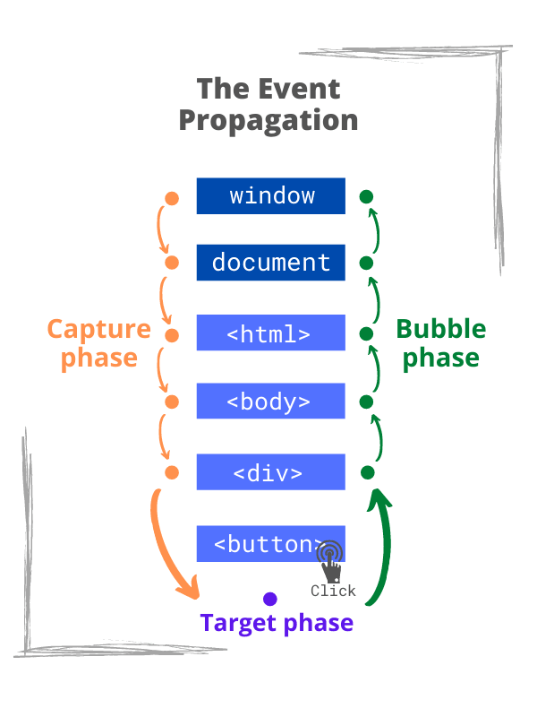

# [JS-Basics] Basics

JavaScript 共有八种数据类型，分别是 Undefined、Null、Boolean、Number、String、Object、Symbol、BigInt。

这些数据可以分为原始数据类型(primitives)和引用数据类型(Object)：

- 栈(stack)：原始数据类型（string, number, bigint, boolean, symbol, null and undefined）
- 堆(heap)：引用数据类型（对象 object、数组 array 和函数 function）

两种类型的区别在于存储位置的不同：

- 原始数据类型直接存储在栈（stack）中的简单数据段，占据空间小、大小固定，属于被频繁使用数据，所以放入栈中存储； (primitive types => by value)
- 引用数据类型存储在堆（heap）中的对象，占据空间大、大小不固定。如果存储在栈中，将会影响程序运行的性能；引用数据类型在栈(stack)中存储了指针，该指针指向堆中该实体的起始地址。当解释器寻找引用值时，会首先检索其在栈中的地址，取得地址后从堆中获得实体。(object => by reference)

---

&nbsp;

#### Primitives

(string, number, bigint, boolean, symbol, null and undefined)

- [Symbol](https://javascript.info/symbol)

#### Object

(function, array(ordered collections), objects(keyed collections), Map(like object, but allows key to be any type), Set(collection of unique values))

- [Map & Set](https://javascript.info/map-set)
- [Object.keys, values, entries are common agreement to use for data structure, ex,Map,Set,Array,Object](https://javascript.info/keys-values-entries)
- [Object's filter,map... method](https://javascript.info/symbol)

&nbsp;

---

&nbsp;

&nbsp;

## Heap and Stack

Stack(Static memory allocation)

- A stack is a data structure that JavaScript uses to store static data. Static data is data where <mark>the engine knows the size at compile time</mark>. In JavaScript, this includes primitive values (strings, numbers, booleans, undefined, and null) and references, which point to objects and functions.
  - primitive values
  - references, which point to objects and functions

The stack contains a reference to the object in the heap: The memory of the heap is not ordered in any particular way, which is why we need to keep a reference to it in the stack.

Since the engine knows that the size won't change, it will allocate <mark>a fixed amount of memory for each value</mark>.
The process of allocating memory right before execution is known as <mark>static memory allocation</mark>.
Because the engine allocates a fixed amount of memory for these values, there is a limit to how large primitive values can be.

Heap(Dynamic memory allocation)

- The heap is a different space for storing data where JavaScript stores objects and functions and it allocate <mark> a fixed amount of memory </mark> for these objects. Instead, more space will be allocated as needed.

&nbsp;

---

&nbsp;

## Type coercion 強制轉型

### +:會轉成 string

### -:會被轉為 number,如果不行轉成數字的話結果會是 NaN

&nbsp;

---

&nbsp;

## null vs undefined

`undefined` is used to describe variables that do not point to a reference.

`null` is used to define something programmatically empty.

https://stackoverflow.com/questions/6604749/what-reason-is-there-to-use-null-instead-of-undefined-in-javascript

TLDR; Don't use the undefined primitive. It's a value that the JS compiler will automatically set for you when you declare variables without assignment or if you try to access properties of objects for which there is no reference. On the other hand, use null if and only if you intentionally want a variable to have "no value".

&nbsp;

### type null vs undefined

:當比較 null 和 undefined 的值的時候，使用非嚴格相等（＝＝）會相同，所以必須使用 typeof 或是嚴格相等（＝＝＝）。

---

## arrow function vs function

arrow function pros:

1. readability

arrow function cons:

1. Do not have this
2. Do not have arguments
3. Can’t be called with new
4. They also don’t have super.

不該使用的時機：  
需要使用 this 的時候，因為會指向上一層（很多時候是 window）

```js
ex.Array.prototype.forEach = () => {
  this; // 指向window，而不是Array
};
```

### 為什麼 arrow function 不能使用`new`?

因為 arrow function 不是 constructor 也沒有[[Construct]]這個方法，所以沒有辦法使用 new，也沒有 this。

Follow up

### 實現一個功能讓構造函數只能 new 操作，否則報錯

```js
function Person(firstName, lastName) {
  // this instanceof Person
  // 如果返回值為 false，說明為普通調用
  // 返回類型錯誤信息——當前構造函數需要使用 new 調用
  if (!(this instanceof Person)) {
    throw new TypeError(
      'Function function Object() { [native code] } A cannot be invoked without "new"'
    );
  }
  this.firstName = firstName;
  this.lastName = lastName;
  this.fullName = this.firstName + this.lastName;
}
// 當作普通函數調用
// Uncaught TypeError: Function function Object() { [native code] } A cannot be invoked without "new"
console.log(Person("戰場", "小包"));
```

follow up:

### new function 和 function 的差別

大部分情況沒有差別，唯一的差別是 new function 會建構一個新的 function object，並且 this 會指向該 function; 相反的，普通的 function 中的 this
會指向 global

References:

https://stackoverflow.com/questions/36416438/whats-the-difference-between-new-function-and-function

https://juejin.cn/post/7057674127926100005

---

https://hsien-w-wei.medium.com/js-arrow-function-vs-function-ec601dead231
https://stackoverflow.com/questions/37587834/why-can-i-not-use-new-with-an-arrow-function-in-javascript-es6

---

&nbsp;

## call, apply and bind

:call, apply 會立即把 this 綁定在 call/apply 的第一個值，讓函式可以動態使用 this。
:bind 會建立新的函式，在被呼叫之後才會綁定。

&nbsp;

**fun.call(thisArg[, arg1[, arg2[, ...]]])**  
:設定 thisArg 值，並且把該 this 綁定在 thisArg 上，後面的參數為原先 function 的 argument.

&nbsp;

```js
var person = {
  fullName: function () {
    return this.firstName + " " + this.lastName;
  },
};
var person1 = {
  firstName: "Bill",
  lastName: "Gates",
};
var person2 = {
  firstName: "Steve",
  lastName: "Jobs",
};
person.fullName.call(person1); // 将返回 "Bill Gates"
```

```js
var person = {
  fullName: function (city, country) {
    return this.firstName + " " + this.lastName + "," + city + "," + country;
  },
};
var person1 = {
  firstName: "Bill",
  lastName: "Gates",
};
person.fullName.call(person1, "Seattle", "USA"); //Bill Gates,Seattle,USA
```

&nbsp;

**fun.apply(thisArg, [argsArray])**  
:用法和 call 類似，但是第二個 parameter 是 array

&nbsp;

```js
var person = {
  fullName: function (city, country) {
    return this.firstName + " " + this.lastName + "," + city + "," + country;
  },
};
var person1 = {
  firstName: "Bill",
  lastName: "Gates",
};
person.fullName.apply(person1, ["Oslo", "Norway"]); //'Bill Gates,Oslo,Norway'
```

&nbsp;

**fun.bind(thisArg[, arg1[, arg2[, ...]]])**  
:會建立新的函式，當函式被呼叫時，會將 this 關鍵字設為給定的參數。

```js

const person = {
  firstName:"John",
  lastName: "Doe",
  display: function () {
    let x = document.getElementById("demo");
    x.innerHTML = this.firstName + " " + this.lastName;
  }
}

//沒有bind Person的話，在setTimeout後，display的this遺失，輸出結果會是undefined
let display = person.display.bind(person);
setTimeout(display, 3000);
//John Doe

https://www.w3schools.com/js/js_function_bind.asp

```

&nbsp;

---

&nbsp;

## Event delegation 事件委派 & addEventListener

事件委託是將事件監聽器添加到父元素，而不是每個子元素單獨設置事件監聽器。當觸發子元素時，事件會冒泡到父元素，監聽器就會觸發，往下傳遞的過程被稱為**捕捉（capturing）**，往上傳遞的過程被稱為**冒泡（bubbling）**

Event delegation 優缺點：

1. event handler 可以大幅減少，只需要設定在父層

&nbsp;

```js
<ul onclick="alert(event.type + '!')">
  <li>One</li>
  <li>Two</li>
  <li>Three</li>
</ul>
//當按到 <li> 其中任何一個onclick都會在bubbling時被觸發
```

&nbsp;



&nbsp;

### 為什麼需要 Event delegation?

### e.stopPropagation vs preventDefault

**e.stopPropagation**: 停止接下來的 bubbling 或是 capturing  
**preventDefault**: 停止 browser 的預定行為（default action）ex,用 preventDefault 來阻止\<a></a>跳轉頁面

### addEventListener:document.addEventListener(event, function, Capture)

第三個 parameter，default 為 false，執行在冒泡階段，  
設定為 true 時，執行在捕捉階段。

https://stackoverflow.com/questions/1687296/what-is-dom-event-delegation

---

## Strict Mode 嚴格模式

用法：在檔案前面加上 ’use strict'  
在嚴格模式下，以下幾種狀況是不被允許的：

1. 直接定義未宣告變數
2. 使用 delete 刪除變數或函式
3. 重複變數
4. 跟其他很多狀況。。

---

## this

&nbsp;
:this 指向（reference）object.而它的值不一定，會根據它被執行的地方(call site)所決定的，以下有四個 this 的規則：

1. 如果執行 function 時，是用`new`來執行的，那 this 會指向一個空的 object.
2. 如果執行 function 時，是用 call,apply,bind，那 this 會指向傳進來的 argument.
3. 如果執行時，是 object 中的一個 method，那 this 會指向 dot 的左邊（該 object).
4. 如果 function 執行時沒有以上條件，this 就會是全局對象. 瀏覽器環境下 this 的值指向 window 對象，但是在嚴格模式下('use strict')，this 的值為 undefined。
5. 如果相同的規則都出現的話，排名前的會先執行。
6. 如果包住 this 的 function 是 arrow function 的話，不適用上面的規則，因為它本身沒有 this，所以 this 會等同於上一層的 this。

用途： ex. 實作 array map method

&nbsp;

```js
const personA = {
  name: "AAA",
  doing: function () {
    console.log(this);
  },
};
personA.doing();
// {name: 'AAA', doing: f}

//當是arrow function時
const personB = {
  name: "AAA",
  doing: () => console.log(this),
};
personB.doing();
// window
```

```js
function makeUser() {
  return {
    name: "John",
    ref: this,
  };
}

let user = makeUser();

alert(user.ref.name); // undefined, 因為ref不是一個function
```

&nbsp;

https://medium.com/codeburst/the-simple-rules-to-this-in-javascript-35d97f31bde3
https://javascript.info/object-methods#this-in-methods
&nbsp;

---

## ES6

---

# Resources

[resources](https://felixgerschau.com/javascript-memory-management/)  
[resources-ch](https://juejin.cn/post/6940945178899251230)  
https://www.w3schools.com/jsref/met_document_addeventlistener.asp  
https://stackoverflow.com/questions/5963669/whats-the-difference-between-event-stoppropagation-and-event-preventdefault  
https://medium.com/itsems-frontend/javascript-strict-mode-d0a3aa74458b  
https://medium.com/@sunnyhuang.sc/%E6%8A%80%E8%A1%93%E7%AD%86%E8%A8%98-javascript-%E4%BD%95%E8%AC%82%E5%BC%B7%E5%88%B6%E8%BD%89%E5%9E%8B-coercion-%E4%BB%A5%E5%8F%8A%E5%A6%82%E4%BD%95%E4%BD%9C%E5%88%B0%E8%BD%89%E6%8F%9B%E5%9E%8B%E5%88%A5-d7e39e30083
https://stackoverflow.com/questions/37587834/why-can-i-not-use-new-with-an-arrow-function-in-javascript-es6
