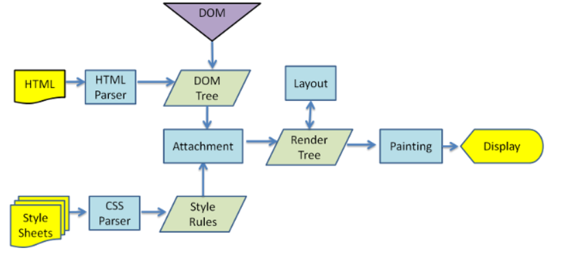
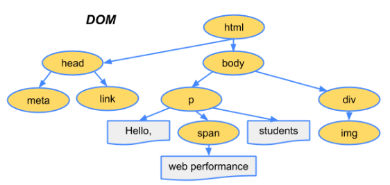
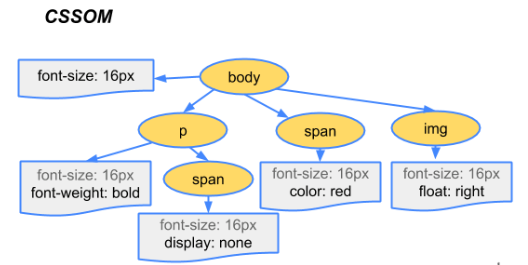

# [JS] DOM and DOM manipulations

## DOM 文件物件模型

:DOM 是 HTML,XML, SVG 文件的程式介面，他把文件跟程式語言（ex, js)綁在一起。透過 DOM，我們可以用 JS 來操控 HTML.

_“It is an abstract representation of structured text, where the structured text is our HTML code.”_

&nbsp;

## DOM manipulation

_DOM manipulation 是很耗費性能的!_

### Why?

TL;DR:
因為 DOM 在 browser 中的操作所造成的 reflow（計算 render tree layout）, repaint(計算 render tree 順序)很消耗性能。

&nbsp;

&nbsp;

這是 Webkit 處理 HTML,Css 的流程。  
webkit 是一個 open source 的 rendering engine,被應用在 chrome, safari 等等。

當 server 在接收到 browser 所收到的請求後，會傳送 HTML/Css 給 browser，並且會發生以下幾件事：

- 首先，rendering engine 會編譯(parse)HTML 和 Css 用瀏覽器提供的各自編譯器(parser)，HTML 會被建構出**巢狀的 Js 物件**稱為 Node Tree (DOM tree)，CSS 則會被架構出巢狀的 CSSOM(CSS object Modal or CSSOM tree)。
- 接下來，rendering engine 會把 DOM tree 和 CSSOM tree 結合成 Render tree。

以上兩步驟完成後，就會進入渲染流程，會有以下幾個步驟：

1. Reflow or Layout stage（排版）階段
   - 瀏覽器首先會為 render tree 中的各個節點建構排版，這包含了計算每個節點在螢幕上的像素尺存以及確切的位置(positions and the coordinates)，透過從 Node 的源頭（root node）開始往下計算每個 element 和其附近的 element 的位置跟關係（ex, 確切距離 exact pixels）。我們將這個過程為 layout（排版），這個過程又被稱作 reflow 或是 browser reflow。要注意的是當我們在捲動螢幕、調整視窗大小或是修改 DOM 元素時，都會觸發 layout 的程序。  
     \*\* 這是一個很消耗性能的步驟，因為他要從頭到尾計算每個 node 之間的距離跟關係。
2. Painting/ repaint (繪圖）階段

   - 在這個階段，排版完的 render tree 有可能會有元素互相重疊（ex, z-index)，透過 painting 這個階段把各個元素的 painting 上下等等順序計算好（ex, background first, then text, then rectangle）。

3. Compositing (組合)階段
   在 compositing（組合）階段時，rendering engine 才會會透過 GPU 被繪製到螢幕中。

&nbsp;

_DOM tree_

&nbsp;

_CSSOM tree_

## DOM traversal

https://zellwk.com/blog/dom-traversals/  
https://medium.com/technogise/dom-manipulation-in-browser-59b793bee559
https://medium.someone.tw/web-%E7%80%8F%E8%A6%BD%E5%99%A8%E5%A6%82%E4%BD%95%E7%B9%AA%E8%A3%BD%E7%B6%B2%E9%A0%81-%E6%8E%A2%E8%A8%8E-dom-cssom-%E8%88%87%E6%B8%B2%E6%9F%93-%E7%BF%BB%E8%AD%AF-e9ba8c2be451
https://medium.com/walkout/%E5%A2%9E%E9%80%B2%E6%95%88%E8%83%BD%E5%BE%9E%E4%BA%86%E8%A7%A3%E7%80%8F%E8%A6%BD%E5%99%A8%E9%96%8B%E5%A7%8B-%E9%97%9C%E9%8D%B5%E6%B8%B2%E6%9F%93%E8%B7%AF%E5%BE%91-595c5da265a9
https://stackoverflow.com/questions/34269416/when-does-parsing-html-dom-tree-happen
https://developer.chrome.com/blog/inside-browser-part3/  
https://zhuanlan.zhihu.com/p/86153264
