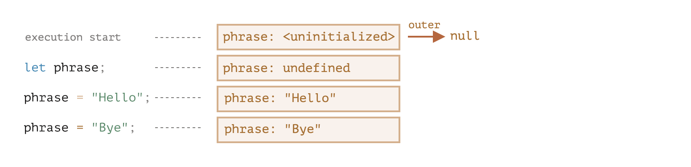
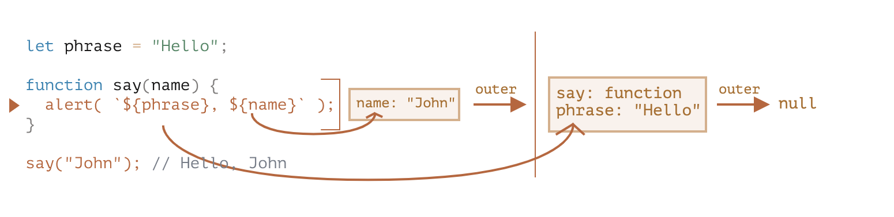

# [JS] Closure

### 定義：Closure 指的是一個 function 記得外在的變數並且可以取用其值，JS 中的所有 function 皆為 closure.

用途： debounce, throttle

&nbsp;

### Lexical Environment 語法環境

&nbsp;

JS 中所有的 function,block {...}, script 都有一個隱藏的 object 叫做 **Lexical Environment**,用來記得可以
access 的變數, 當程式碼被執行時都會生成 lexical environment (ex, function, script(global lexical environment)).

&nbsp;

Lexical Environment 由兩個東西組成：

1. Environment Record: 一個 object 儲存所有的 local object.
2. a reference to 外在的 lexical environment.

&nbsp;



&nbsp;

function 有自己的 lexical environment.



&nbsp;

Ex.

```js
function makeCounter() {
  let count = 0;

  return function () {
    return count++;
  };
}

let counter = makeCounter();

alert(counter()); // 0
alert(counter()); // 1
alert(counter()); // 2
```

&nbsp;

Reference:  
https://javascript.info/closure  
https://dev.to/somedood/emulating-private-variables-in-javascript-with-closures-and-factory-functions-2314
