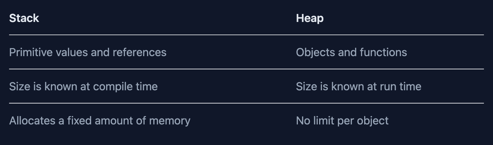

# [JS] Deep copy & Shallow copy

### pass by value, pass by reference

&nbsp;

**Js 資料型別：基本型別（primitives), 物件型別 （object)**

&nbsp;

**Pass by value**: 儲存在 stack

- stack 中儲存靜態資料，靜態資料代表 js engine 在 compile time 就知道檔案大小（fixed amount of memory)

* 基本型別（primitives): Undefined、Null、Boolean、Number、String、Object、Symbol、BigInt。

**Pass by references**: 儲存資料所在的位址（reference）在 stack, reference 指向 Heap

- 物件型別（Object): object, array, function



```js
//by reference
//example1
let a = {};
let b = a; // copy the reference

alert(a == b); // true, both variables reference the same object
alert(a === b); // true

//example2
let a = {};
let b = {}; // two independent objects

alert(a == b); // false

//objectData example3
function test(objectData) {
  objectData.number = 10;
  console.log(objectData); // { number: 10 }
}

let a = { number: 5 }; // Object
test(a);

console.log(a); // { number: 10 } => 跟著改變
```

&nbsp;

```js
//primitiveData by value

function test(primitiveData) {
  primitiveData = primitiveData + 5;
  console.log(primitiveData); // 10
}

let a = 5; // Primitive
test(a);

console.log(a); // 5 => 沒被改變
```

&nbsp;

---

&nbsp;

### Deep copy & Shallow copy

定義：

Shallow copy:  
淺拷貝是創建一個新對象，這個對象有著原始對象屬性值的一份精確拷貝。如果屬性是基本類型，拷貝的就是基本類型的值，如果屬性是引用類型，拷貝的就是內存地址 ，所以如果其中一個對象改變了這個地址，就會影響到另一個對象。

Deep copy:  
深拷貝是將一個對象從內存中完整的拷貝一份出來,從堆內存中開闢一個新的區域存放新對象,且修改新對象不會影響原對象。

閱讀文章:  
https://juejin.cn/post/6844904197595332622

&nbsp;

**Shallow copy:**

1. spread operator
2. Object.assign
3. lodash's \_.clone
4. Array.prototype.slice()

```js
let user = {
  name: "John",
  age: 30,
};

let clone = {}; // the new empty object

// let's copy all user properties into it
for (let key in user) {
  clone[key] = user[key];
}

// now clone is a fully independent object with the same content
clone.name = "Pete"; // changed the data in it

alert(user.name); // still John in the original object**
```

```js
Object.assign(dest, [src1, src2, src3...])
let user = { name: "John" };

let permissions1 = { canView: true };
let permissions2 = { canEdit: true };

// copies all properties from permissions1 and permissions2 into user
Object.assign(user, permissions1, permissions2);

// now user = { name: "John", canView: true, canEdit: true }
```

```js
spread operator
let user = { name: "John" };

let permissions1 = { canView: true };
let permissions2 = { canEdit: true };

// copies all properties from permissions1 and permissions2 into user
const newObject = {...user, ...permissions1, permissions2}

console.log(newObject)
// now user = { name: "John", canView: true, canEdit: true }

```

&nbsp;

**Deep copy**

1. JSON.parse(JSON.stringify())
2. lodash \_.cloneDeep
3.

&nbsp;

- JSON stringify + JSON parse

```js
let user = { name: "John" };

let permissions1 = { canView: true };
let permissions2 = { canEdit: true };

// copies all properties from permissions1 and permissions2 into user

const newObject = { ...user, ...permissions1, permissions2 };

const deepCopyObject = JSON.parse(JSON.stringify(newObject));

deepCopyObject.canView = false;
console.log(newObject); // // now user = { name: "John", canView: true, canEdit: true }
console.log(deepCopyObject); //  // now user = { name: "John", canView: false, canEdit: true }

// now user = { name: "John", canView: true, canEdit: true }
```

缺點：

1. undefined : 會連同 key 一起消失
2. NaN : 會被轉成 null
3. Infinity :會被轉成 null
4. regExp : 會被轉乘 空 {}
5. Date : 型別會由 Data 轉成 string
6. 無法處理 function

&nbsp;

structuredClone(Node 17):

&nbsp;

```js
const clone = structuredClone(original);
```

&nbsp;

手寫深拷貝  
https://juejin.cn/post/6844903929705136141#heading-6
https://www.programfarmer.com/articles/javaScript/javascript-shallow-copy-deep-copy

---

Resources:

推薦閱讀資源： https://felixgerschau.com/javascript-memory-management/
