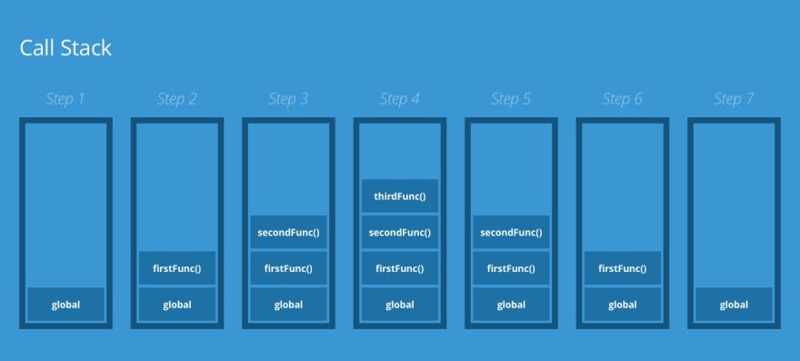
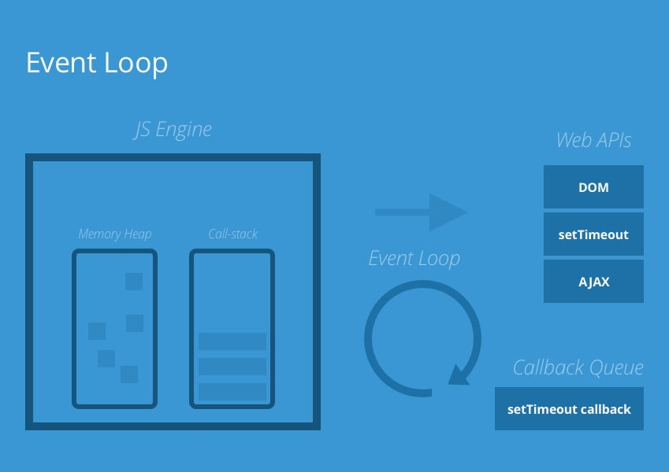

# [JS] The Execution Context, Call-stack and Event Loop

解決的問題： JS 本身是 single threaded,代表一次只能有一個 function 被執行。

## The Execution Context

當程式碼被執行時，會產生 `Global Execution Context`。然後 engine 進入 `creation phase` ，四件事情會發生：

1. 建立 global 物件，在 browser 中被稱作`window`，在 Node 中被稱作`global`
2. create `this` 並且與 global 物件 binding
3. 建立一個 memory heap 來儲存 variables 和 function references  
   [memory heap 的文章](../Javascript/Basics/basics.md)
4. 把 function declarations (function s()...)儲存在 memory heap 然後把裡面的 variable 賦予`undefined`

完成後，engine 會進入下一個階段`execution phase`。

在這個階段，程式碼會被一條條的執行，

1. variable 會被賦予值，
2. function 則會被執行，並且在每個 function 被執行時，engine 都會 create 一個 `Function Execution Context` （類似上面的 `Global Execution Context`），但是 global 物件會被指到 `arguments`物件，裡面會儲存所有傳進 function 的值。

keyword: `Global Execution Context`, `creation phase`, `execution phase`

&nbsp;

&nbsp;

**當出現多個 function,觸發多個 `Function Execution Context`時，engine 又要怎麼處理呢？**

&nbsp;

## The Call-stack

: `The call-stack` 是一種資料結構（stack）用來追蹤和管理`function execution`。

實際情況：`The call-stack` 依照 Last In First Out 的規矩，當 engine call 到 function 時，會把該 function push 到 `call-stack` 裡，並且在執行該 function 時，會把該 function 從`call-stack` 中 pop 掉，

&nbsp;



&nbsp;

Example,

```js
function thirdFunc() {
  console.log("Greetings from thirdFunc()");
}

function secondFunc() {
  thirdFunc();
  console.log("Greetings from secondFunc()");
}

function firstFunc() {
  secondFunc();
  console.log("Greetings from firstFunc()");
}

firstFunc();

// Greetings from thirdFunc()
// Greetings from secondFunc()
// Greetings from firstFunc()
```

## The Event Loop and The callback queue

解決的物題：讓 JS 可以執行非同步的動作（ex, network request）

&nbsp;



&nbsp;

實際情況：`The event loop`追蹤 `call-stack`中需要執行 asynchronous 的 function,當執行到該 function 時把他丟入`callback queue`中（First-in, First-out),

1. 當 `call-stack`其他 function 都執行完，變回空的時候。
2. 處理 `callback queue`中的 function 丟回到`call-stack`上來執行。

`callback queue`的執行順序為： Microtask > Macrotask

常見的 microTask: Promise  
常見的 macroTask: setTimeout, setInterval... (與瀏覽器或電腦底層的運作較有關係)

```js
setTimeout(() => alert("timeout"));

Promise.resolve().then(() => alert("promise"));

alert("global ex. context");

// global ex. context
// promise
// timeout
```

&nbsp;

# Resources

https://dev.to/thebabscraig/the-javascript-execution-context-call-stack-event-loop-1if1
https://pjchender.dev/javascript/note-event-loop-microtask/
