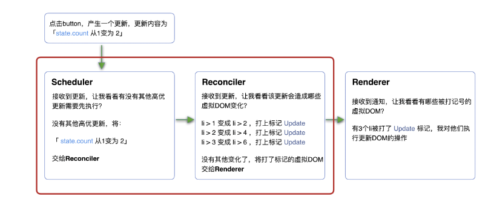

# [React] React 18

---

推薦閱讀文章:  
https://react.iamkasong.com/#%E5%AF%BC%E5%AD%A6%E8%A7%86%E9%A2%91

---

React 想解決的兩個問題：

1. CPU 瓶頸
2. IO 瓶頸

**要達到以下所做的事，必須做到讓同步的更新變為可中斷的異步更新。在 React 16 中更改了 Scheduler, reconciler, Renderer 的架構來達到上面的事。**

Scheduler（調度器）—— 調度任務的優先級，高優任務優先進入 Reconciler
Reconciler（協調器）—— 負責找出變化的組件，如果 Scheduler（調度器)有標記過高優先順序的任務，Reconciler（協調器）就會暫停當前任務，並且優先執行任務順序高的任務。
Renderer（渲染器）—— 負責將變化的組件渲染到頁面上

---

### CPU 瓶頸

TL;DR

用 time slicing 來確保就算因為 CPU 瓶頸所以導致 JS loading 變大 blocking 到 paint,composition 時，還是可以透過把任務切分成 chunks 的方式，預留五秒給瀏覽器做 painting，來達到畫面不卡頓的效果。

瀏覽器在執行時，會依照 critical rendering path 的順序解析，主流 device 刷新頻率為 60Hz，即每（1000ms / 60Hz）16.6ms 瀏覽器刷新一次，所以當 JS(DOM 中)執行過長時，就會擋到後面的 paint, composition，造成畫面出現卡頓。  
[範例](https://harttle.land/2017/08/15/browser-render-frame.html)

刷新率:單位為赫茲，代表每秒螢幕更新螢幕的次數，60hz 就代表每秒可以更新螢幕影像 60 次。

React 解決方法：

在瀏覽器每一幀的時間中，預留一些時間給 JS 線程，React 利用這部分時間更新組件（在源碼中，預留的初始時間是 5ms）。
當預留的時間不夠用時，React 將線程控制權交還給瀏覽器使其有時間渲染 UI，React 則等待下一幀時間到來繼續被中斷的工作。換句話說，time slicing 就是將同步的更新變為可中斷的異步更新。所以在執行 JS 任務時，預先預留出時間，當工作執行過長時，就先暫停當前的工作，等下一次的刷新渲染時，再繼續執行。

### IO 瓶頸

網路延遲是前端無法解決的問題，但是可已透過更改畫面的顯示，來增加使用者體驗。

React 利用 `useTransition`來把任務設定成非緊急，讓任務可以被 interrupt，來避免因為一個 loading 太久而導致頁面卡頓的情況。
[useTransition 舉例](https://beta.reactjs.org/apis/react/useTransition)

---

Resources:

https://react.iamkasong.com/preparation/idea.html#cpu%E7%9A%84%E7%93%B6%E9%A2%88
https://medium.com/jspoint/how-the-browser-renders-a-web-page-dom-cssom-and-rendering-df10531c9969

瀏覽器 frame rate
https://harttle.land/2017/08/15/browser-render-frame.html
