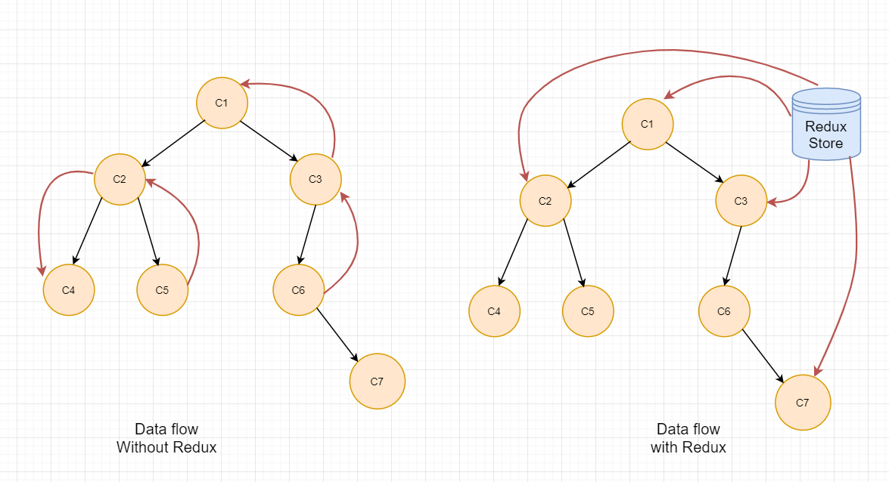
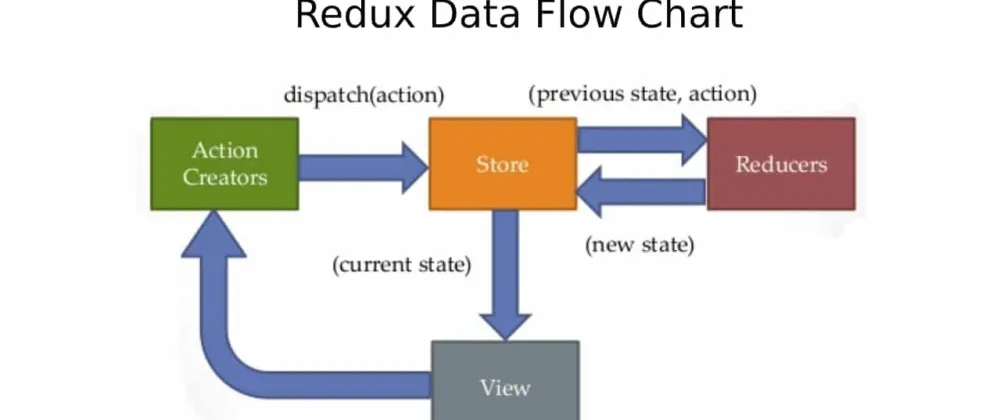

# [React] Redux

## 為什麼需要 Redux?

:在大型專案中，state 的數量變得愈來越能掌握，這時候我們需要一個共同儲存 state 的地方，讓我們能夠在任何 component 中使用。  
redux 的優點為

1. 建立了一個 store 來管理 global state(single source of truth)。
   
2. state 是唯獨的，並且唯一的方法是透過 dispatch action，藉此來達到 immutable 來防止 mutate 到 state。
3. 可以把 state 分到個別的 reducer 裡面。

## Redux-Flow



三個主要的概念：store, action, reducer

過程：從 store 拿到 state，顯示在 view 上，然後當要做 state 更動時，發起一個 action 到 state 裡的 reducer 裡面，reducer 裡面描述了 action 要如何更動 state，最後被更動的 state 會回到 store 裡面，完成一次循環。

## context api+useReducer vs Redux

Redux: 適用於大型得專案，有豐富的 middleware 等第三方套件可以使用。
context api+useReducer:適用於小型專案，學習曲線低且易於使用。。

## Redux Thunk vs Redux Saga

#### Redux Thunk:

:讓 action 可以返回一個 function，而裡面可以做非同步的操作。  
缺點:每個非同步操作都需要搭配 action，可能會造成難以管理。

```js
//thunk action => return a function
export function thunkAction() {
  return async (dispatch) => {
    const result = await new apis.Store(); // call api
    dispatch({ types: "xxx", data: result });
  };
}
```

```js
// action
export function action() {
  return {
    type: "xxx",
    data: xxx,
  };
}
```

#### Redux Saga：

:功能更為強大。

https://juejin.cn/post/6844903918103691271

https://www.eternussolutions.com/2020/12/21/redux-thunk-redux-saga/#:~:text=Saga%20works%20like%20a%20separate,be%20minimized%20in%20redux%2Dthunk

https://juejin.cn/post/6973977847547297800
