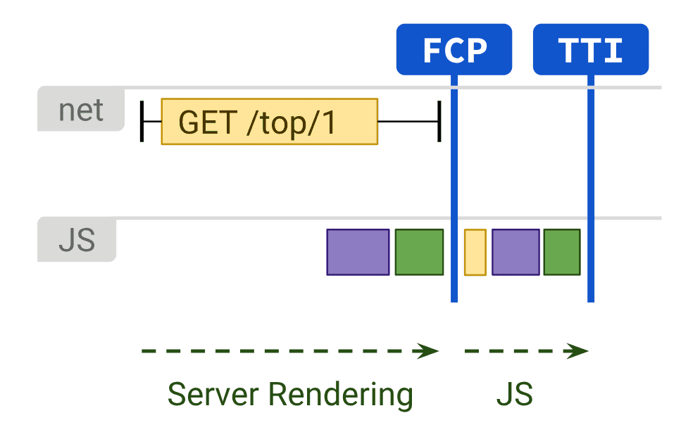

# [鐵人賽 2022-擊敗前端面試大作戰] client-side-rendering vs server-side-rendering

## Client-side Rendering 客戶端渲染

Client-Side Rendering 指的是網頁渲染大部分都透過瀏覽器端來完成。所有的邏輯、取資料、路由等等都在瀏覽器裡處理。這樣的優點是整個網頁會在第一次渲染的時候完成，並且大部分的 UI 會在客戶端產生，所以當使用者換頁的時候，速度會很快使用者體驗會很好，因為大部分的架構不需要經過 server，都會是在客戶端完成。缺點則會有以下兩點：

1. SEO 不好
   CSR 在第一次跟 server 請求 HTML 時，HTML 檔案裡面幾乎沒有任何內容，是透過載入 JS bundle 再去把畫面 render 到 HTML 裡，因此速度上不一定能夠讓網路爬蟲可以索引到該網站。

```js
//初始的HTML檔案
<html>
    <head>
        <link href="/static/css/main.css" rel="stylesheet">
    </head>
    <body>
        <div id="root"></div>
    </body>
    <script src="/static/js/bundle.js"></script>
</html>
```

關於這部分的解釋我推薦[這篇文章](https://lidemy5thwbc.coderbridge.io/2022/01/29/CSR-SSR/)的解釋！

2. 效能不好  
   
   CSR 會在 render 的時候 load 全部打包完的程式碼，當網頁變得越來越複雜功能越變越多，Javascript 檔案的大小也越變越大，造成網頁的 FCP 跟 TTI 都增加，代表使用者會在看到網頁之前，有一段時間是只有白頻的情況，造成使用者經驗不佳。

CSR 優化方法

1. 打包 JS，把 JS 檔案縮小，
2. code splitting
   避免出現一個檔案非常大的打包程式碼，透過 code splitting 把打包切分成不同的小檔案，來減少使用者畫面白頻的情況。

   在 Create react app 或是 Next.js，我們可以直接使用 code splitting，所以只有在用到這行程式碼的情況下，才會去引入 math.js。下面的例子，React 可以直接使用`import()`語法來使用 code splitting。

```js
//Before code splitting
import { add } from "./math";
console.log(add(16, 26));

//After code splitting
import("./math").then((math) => {
  console.log(math.add(16, 26));
});
```

3. lazy loading
   可以讓網頁只先 render 重要的部分，把比較不重要的資源等到要使用時再 load。同樣的，React 也有提供簡便的方式來達到 lazy loading，我們只要用`React.lazy`的語法，包住一個使用`import()`語法的地方，就可以達到 lazy loading 的效果！

```js
import React, { Suspense } from "react";

// lazy loading
const OtherComponent = React.lazy(() => import("./OtherComponent"));

function MyComponent() {
  return (
    <div>
      <Suspense fallback={<div>Loading...</div>}>
        <OtherComponent />
      </Suspense>
    </div>
  );
}
```

關於 React lazy loading, code splitting 額外的介紹，我推薦[這篇文章](https://medium.com/starbugs/react-%E7%82%BA%E5%A4%AA%E9%BE%90%E5%A4%A7%E7%9A%84%E7%A8%8B%E5%BC%8F%E7%A2%BC%E5%81%9A-lazy-loading-%E5%92%8C-code-splitting-7384626a6e0d)

4. 用 service worker 來使用快取頁面，讓後續的訪問讀取可以更快速，並且也提供離線訪問等功能。

## Server-Side Rendering

當使用者透過 URL request 一個網站的時候，server 會處理 JS 和 HTML 再回傳一個完整的 HTML 給瀏覽器，所以瀏覽器只需要去解析該 HTML 就可以顯示畫面。



SSR 的優點是，FCP(request 的內容第一次出現的時間）會比較快，因為 server 已經做完 render 的工作，並且會回傳完整的 HTML，可以直接解析，然後顯示在畫面上，節省掉解析 JS 的時間。也因次只要畫面顯示在頁面上，網站馬上就可以接受使用者的指令可以較快開始互動，TTI(網頁可以互動的時間)也會因此很快。除此之外，SEO 也會很好，因為 SSR 會產生完整的 HTML 給 browser，所以可以很容易的被爬蟲解讀。

SSR 的缺點主要有以下幾點：

1.  TTFB(Time To First Byte 的縮寫，顧名思義為從用戶端送出對伺服器的請求後，瀏覽器收到伺服器響應資料的時間)會比較慢，因為伺服器需要先生成完整的 HTML 後，再傳給瀏覽器。除此之外，如果同時有許多人造訪 server 或是使用者有緩慢地網速等等造成 server 負擔重的情況都會影響到 TTFB。
2.  互動性體驗差，因為 SSR 的頁面在每次互動之間都要重新在 server 重新讀取頁面，導致使用體驗跟網頁反應上不如 CSR 的頁面順暢。

統整一下，今天我們講了 CSR 跟他的優缺點還有如何去解決它的問題，並且我們還講了 SSR 跟其優缺點！下面就推薦給大家一個[資源](https://www.patterns.dev/posts/static-rendering/)，有興趣的人可以自行去閱讀摟！

---

面試題：

1. 什麼是 CSR?
2. 什麼是 SSR?

Resources:

https://www.patterns.dev/posts/client-side-rendering/
https://www.patterns.dev/posts/server-side-rendering/
https://www.youtube.com/watch?v=k-A2VfuUROg
https://reactjs.org/docs/code-splitting.html#reactlazy
https://lidemy5thwbc.coderbridge.io/2022/01/29/CSR-SSR/
https://medium.com/@prashantramnyc/server-side-rendering-ssr-vs-client-side-rendering-csr-vs-pre-rendering-using-static-site-89f2d05182ef

https://blog.niclin.tw/2019/01/06/%E6%B7%BA%E8%BF%B0-ssr-spa-%E5%84%AA%E7%BC%BA%E9%BB%9E/
https://web.dev/rendering-on-the-web/

https://medium.com/@prashantramnyc/server-side-rendering-ssr-vs-client-side-rendering-csr-vs-pre-rendering-using-static-site-89f2d05182ef
https://dev.to/matfrana/server-side-rendering-vs-static-site-generation-17nf

React with SSR
https://www.digitalocean.com/community/tutorials/react-server-side-rendering
