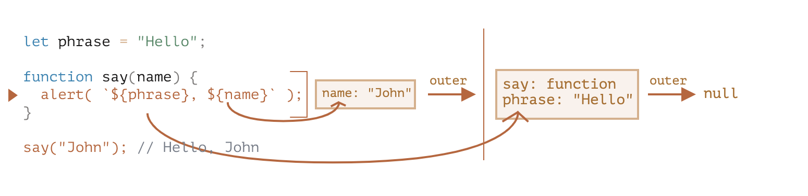

# [鐵人賽 2022-擊敗前端面試大作戰] Closure 閉包

今天是 JS 系列的的第二篇文章，今天要來討論一個讓人又愛又恨的 JS 特性---閉包 closure！

&nbsp;

### 什麼是閉包？

回答：閉包 指的是一個 function 記得外在的變數並且可以取用其值，JS 中的所有 function 皆為 closure.

面試回答思路：可以先回答閉包的定義，然後帶到`語法環境`跟閉包實際上是怎麼記得外在變數的。

下面我們來介紹一下閉包，我們來看一下下面的程式碼，猜猜看`outerFunc`執行結果會是什麼？

```js
function outerFunc() {
  let outerVar = "I am outside!";
  function innerFunc() {
    console.log(outerVar);
  }
  innerFunc();
}
outerFunc();
```

猜對了嗎？答案是： `"I am outside!"`，因為內部的 function 可以記得外在的變數，因此可以找到 outerVar 這個變數，所以 console.log 的結果是`"I am outside!"`。

但內部的 function 要怎麼找到或是記住外在的變數呢？這就要講到詞法環境(Lexical environment)了。

&nbsp;

### 什麼是 詞法環境(Lexical environment)？

Lexical environment - where something sits physically in the code you write and what surrounds it. In JavaScript where you write something is important.

定義：JS 中所有的 function,block, script 都有一個隱藏的 object 叫做 **詞法環境 Lexical Environment**,用來記得其可以取得的變數，function 有 function 的詞法環境, script 也有全局詞法環境。

而詞法環境則是由兩個東西所組成：

1. Environment Record: 一個 object 裡面儲存了所有的 local 變數
2. 一個 reference 來記得外在的詞法環境.

&nbsp;



在上面的圖中，在這裏的橘底框框就是詞法環境的 Environment Record，而裡面的值就是該 Environment Record 中的變數。圖中我們可以看到有兩個 Environment Record，一個是 function say 的詞法環境，另外一個則是 script 的全局詞法環境。

當我們呼叫了 say 這個 function，並且給他`John`的值之後，可以看到他執行時，會先去找**內部的詞法環境**，找到 name 的值之後，再去透過 reference 去連接到**外在的詞法環境**，最後找到 phrase 的值，而這也是為什麼最後輸出結果會是 Hello, John 的原因。因為
_當程式碼要去找值的時候，會先去**內部的詞法環境**找，如果找不到，再去**外在的詞法環境**找！_

來統整一下今天討論到的幾個重點：

1. 閉包 指的是一個 function 記得外在的變數並且可以取用其值，JS 中的所有 function 皆為 closure.
2. 閉包怎麼記得外在變數的？透過`詞法環境`中的`Environment Record`和`reference`
3. 找值時會先去**內部的詞法環境**找，如果找不到，再去**外在的詞法環境**找

```js

function b() {
  console.log(myVar)
}

function a() {
  let myVar = 2
  b()
}

let myVar = 1
a()


ANS: 1
因為Lexical environment如果在內層中找不到變數的話就會往外面一層去找，並且會從該函式的位址開始往外找，像是在這裡，因為function b的外層就是global，所以function b會找到global裡面的myVar變數。

```

&nbsp;

下面依照慣例放上一些面試題，讓讀者來自己回答看看摟！

### 面試題

1. 什麼是閉包？
2. 值會是什麼？

Ex.

```js
function makeCounter() {
  let count = 0;

  return function () {
    return count++;
  };
}

let counter = makeCounter();

alert(counter());
alert(counter());
alert(counter());
```

3. console.log 結果會是什麼？

```js
(function immediateA(a) {
  return (function immediateB(b) {
    console.log(a); // What is logged?
  })(1);
})(0);
```

4. log 會是什麼？

```js
function createIncrement() {
  let count = 0;
  function increment() {
    count++;
  }
  let message = `Count is ${count}`;
  function log() {
    console.log(message);
  }

  return [increment, log];
}
const [increment, log] = createIncrement();
increment();
increment();
increment();
log(); // What is logged?
```

5. 接續上一題，怎麼 log 出正確的數字？
6. 閉包的缺點？

- 佔用內存，增加內存使用量。
- 使用不當會很容易造成內存洩露。

&nbsp;

Reference:  
https://javascript.info/closure  
https://dev.to/somedood/emulating-private-variables-in-javascript-with-closures-and-factory-functions-2314
https://nissentech.org/why-do-we-need-closure/
