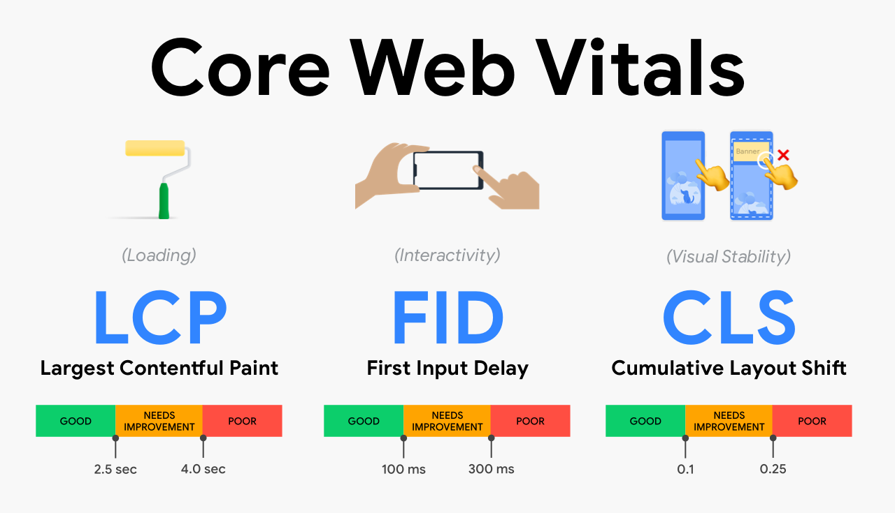

# [鐵人賽 2022-擊敗前端面試大作戰] Core Web Vital and lighthouse

## 什麼是 core web vital?

web vital 是 Google 在 2021 年所推出的衡量網站的指標。而 core web vital 是 web vital 中最重要的三個指標，分別是 Largest Contentful Paint(LCP), First Input Delay(FID)和 Cumulative Layout Shift(CLS)。全部的 web vital 變化可以在[這裡看](https://chromium.googlesource.com/chromium/src/+/master/docs/speed/metrics_changelog/README.md)

## 怎麼計算 core web vital?

## metrics 種類

metrics 全部可以分成五大類：

1. Perceived load speed: 網站可以多快的 load 然後 render 出畫面
2. Load responsiveness: 網站可以多快的接收使用者操作的指令 ex, click a button
3. Runtime responsiveness: 在網站跑完之後，網站多快可以對使用者操作進行反應
4. Visual stability:網頁是不是穩定的，會不會有奇怪的 bug 出現，或是一點進去頁面就有一堆廣告或是圖片來影響使用體驗
5. Smoothness: 網頁的動畫或是換頁是不是在穩定的 frame rate，並且是穩定的

重要的 metrics:

1.

Resources:

https://web.dev/learn-core-web-vitals/
https://www.hububble.co/blog/core-web-vitals
