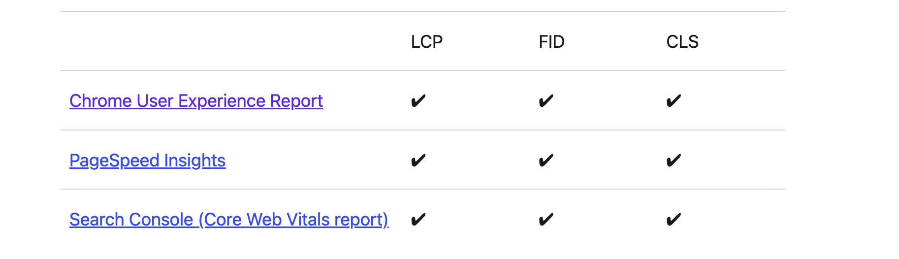
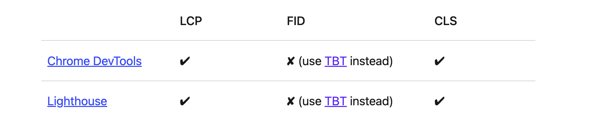
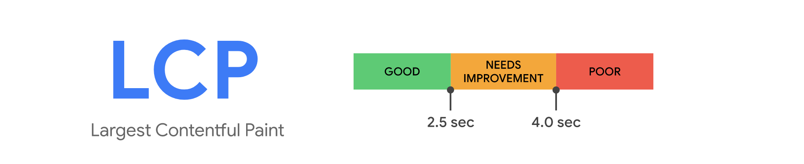
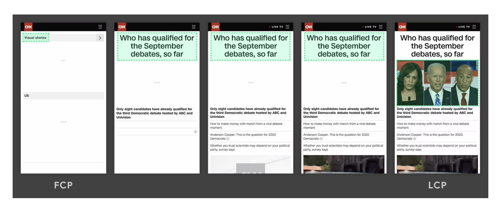
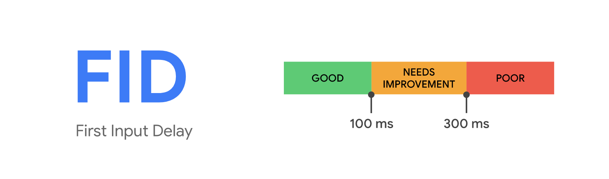
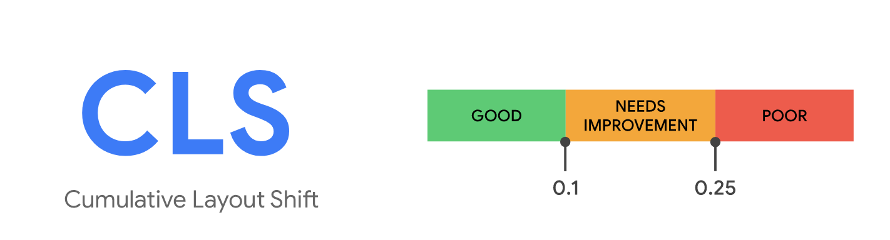
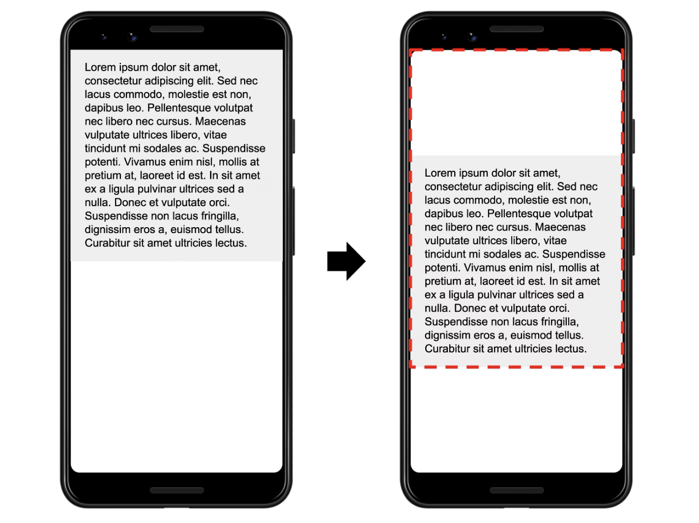
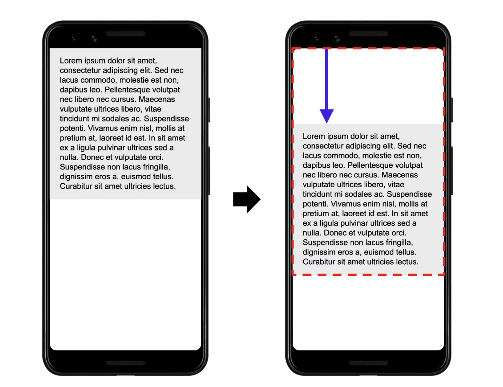

# [鐵人賽 2022-擊敗前端面試大作戰] Core Web Vital and lighthouse

## 什麼是 core web vital?

web vital 是 Google 在 2021 年所推出的衡量網站的指標，並且這個指標會直接影響到 SEO 跟網站順序 ranking!!而 core web vital 是 web vital 中最重要的三個指標，分別是 Largest Contentful Paint(LCP), First Input Delay(FID)和 Cumulative Layout Shift(CLS)。全部的 web vital 變化可以在[這裡看](https://web.dev/metrics/)

## 怎麼計算 core web vital?

core web vital 的測試方式依測試環境可以分為兩種，第一種是在非 production 環境中所做的測試來模擬使用者的使用情形，官網稱之為 in the lab。In the lab 測試適合用在測試新功能是否造成整體網頁的效能降低，但缺點則是無法完整的展現實際使用者在操作網頁時所產生的情況。 第二種測試方式則是實際使用者在操作頁面時，所產生的測試數據，官網稱之為 in the field，這種測量的方式可以準確的偵測到使用者在操作時所產生的數據！那要使用用哪些工具來測量這兩種環境呢？

用來做 in the field 測量的工具：  

或是你也可以透過 google 做的[套件](https://github.com/GoogleChrome/web-vitals)來在 JS 來測量你的 core web vital。

用來做 in the lab 測量的工具:

\*\*注意: 因為是模擬使用者的使用情形，所以不會有 FID，google chrome 在這裡用 TBT(Total blocking time)來代替。\*\*

## metrics 種類

web vitals 全部可以分成五大類：

1. Perceived load speed: 網站可以多快的 load 然後 render 出畫面
2. Load responsiveness: 網站可以多快的接收使用者操作的指令 ex, click a button
3. Runtime responsiveness: 在網站跑完之後，網站多快可以對使用者操作進行反應
4. Visual stability:網頁是不是穩定的，會不會有奇怪的 bug 出現，或是一點進去頁面就有一堆廣告或是圖片來影響使用體驗
5. Smoothness: 網頁的動畫或是換頁是不是在穩定的 frame rate，並且是穩定的

了解什麼是 Core Web Vital 跟其種類之後，下面我們就來正式介紹他吧！

## Core Web Vital

## Largest Contentful Paint(LCP)

#### 什麼是 LCP?

The Largest Contentful Paint (LCP) metric reports the render time of the largest image or text block visible within the viewport, relative to when the page first started loading.這項指標建議的時間是低於 2.5 秒，也是上面的圖高於 75%的綠色區間。

哪些元素會被算在 LCP 得範圍內？

`img`

`image`

`video`

`background-image: url()`

`
**注意: LCP 只會只計算在 viewport 裡面看得到的部分，元素上如果有 overflow 等等元素或是超出 viewport 則不會加入計算**
怎麼計算？

下面我們來看點實際的案例：

透過上方的表可以看到，一開始畫面中最大的 element 是左上角的標題然後到第二張圖就變成大標題，直到最後一張圖，畫面中最大的 element 變成圖檔。由此可知，最大的 element 是會變動的，隨著最大的 element 離開畫面或是更大的 element 出現，都有可能影響到最後的 LCP。

#### LCP 優化方法

- 優化 CSS
- 優化 Image
- 優化 fonts
- 優化 Critical Rendering Path

https://web.dev/lcp/

假如我們畫面中最大的 element，並不是最重要的 element 那怎麼辦？我們要怎麼去測量畫面中最重要的畫面的 render Time?  
這時候我們就可以用 Google 所提供的 Element Timing API 來創建一個自己的 custom metrics 了！我們可以用用 `elementtiming` attribute 加在你想測量的 element 上，再加上 PerformanceObserver JS 去監測，這樣我們就可以知道監測的 element 所花費的 render time 了！
https://web.dev/custom-metrics/#element-timing-api

### First Input Delay (FID)

### 什麼是 First Input Delay (FID)

FID 計算使用者與網頁**首次互動**的**延遲時間**，例如點擊連結、按鈕或按壓鍵盤（捲動、放大網頁不在計算範圍內）等事件後後，瀏覽氣延遲多久時間才去處理該事件。
FID measures the time from when a user first interacts with a page (i.e. when they click a link, tap on a button, or use a custom, JavaScript-powered control) to the time when the browser is actually able to begin processing event handlers in response to that interaction.
這項指標建議的時間是低於 100ms，也是上面的圖的綠色區間。
\*\*注意: 這項指標是計算使用者的互動延遲時間，所以只會在 in the field 測量中出現，in the lab 測量(ex, chrome lighthouse)中用 TBT(Total blocking time)來取代。\*\*

造成 FID 的原因，是當瀏覽器正在處理其他的事情，像是解析一個大的 JS 檔案/css 檔案，因而造成主線程阻塞而無法同時處理使用者的輸入的情況，常見的 FID 像是點擊按鈕但是延遲了一陣子網頁才反應。

#### FID 優化方法

- 減少大型 JS 程式碼的執行時間
  - 把非 UI 的 JS 工作放到 web worker，來減少主線程的工作量
  - code-splitting
  - async, defer 來處理 JS file 加載順序，defer 比較不重要得 JS 檔案

## Cumulative Layout Shift (CLS)

### 什麼是 Cumulative Layout Shift (CLS)

CLS 指標指的是網頁上的元素，包含字體、圖像、影片、表單或是按鈕等或是排版的不正常移動，Google chrome 所給予的一個分數，分數約低越好，一般來說建議 CLS 分數在 0.1 以下。
確切計算的方式是 Google chrome 透過 [Layout Instability API](https://github.com/WICG/layout-instability)，來偵測畫面中的元素變動，並且根據變動的範圍跟大小測量出一個叫做*layout shift score*的數字，最後在頁面活動時所產生最高的*layout shift score*就會是 CLS 的值。下面我們來繼續去看*layout shift score*的公式，

**layout shift score = impact fraction \* distance fraction**

第一個值 impact fraction，計算的是整個網頁元素不正常移動的整體範圍，包含不正常移動前到移動後的整體範圍。我們看下面的圖，從左手的畫面到不正常移動後的右手畫面的完整範圍，也就是下面用紅色點點圈起來的範圍，就是我們的 impact fraction 範圍，他大概站了整個畫面的 75 趴，所以在這裡我們的 impact fraction 就會是 0.75。

下一個我們來看第二個值，distance fraction

distance fraction 計算的是網頁元素不正常移動的距離。我們看下面的照片，裡面的文字從左邊跳到右邊，他們跳動的距離就是紫色箭頭的長度，而這個長度也就是 distance fraction 的值。下圖的紫色長度大概佔了畫面的四分之一，所以我們可以估計這裡的 distance fraction 是 0.25

最後我們把 impact fraction 跟 distance fraction 這兩者乘起來就會是我們的 layout shift score`0.75 * 0.25 = 0.1875`！

#### CLS 優化方法

- 不去修改 height/weight，用 css `transform:scale()`
- 如果要移動 element，不要直接改`top`,`bottom`等，用`transform:translate()`
- img, video, iframe 可以的話設定 aspect ration, 不然就是用 width, height 屬性，或是用 calc()來設定大小
- call api 時設定 spinner 來避免等待 api 跟收到 api 之後造成畫面移動

今天介紹到了網頁優化很重要的三個重要指標，Largest Contentful Paint(LCP), First Input Delay(FID)和 Cumulative Layout Shift(CLS)，那我們明天會注重在照片 image 的優化，我們明天見摟！

---

Resources:

https://web.dev/learn-core-web-vitals/
https://www.hububble.co/blog/core-web-vitals
https://web.dev/cls/
https://web.dev/optimize-cls/
https://5xruby.tw/posts/seo-core-web-vitals
