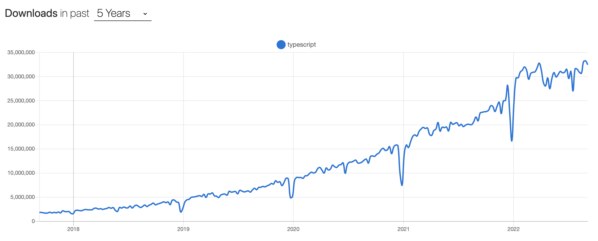

# [鐵人賽 2022-擊敗前端面試大作戰] 什麼是 Typescript?

今天是鐵人賽的第十六篇文章，也是 Typescript 系列的第一篇文章，這系列文章總共會有四個篇幅，內容會從為什麼需要 Typescript 開始，再來介紹幾個我覺得蠻有趣的用法。

## Typescript 是什麼？


TypeScript 是 JavaScript 的一個超集(superset)，主要提供了型別系統和對 ES6 的支援。換句話說，TypeScript 就像是打了類固醇的健身選手，能夠讓程式碼更強壯、更少 bug 的出現。但相同的，打藥之後一定會有犧牲，Typescript 也是有的，它需要一定的學習成本，並且也要寫更多的程式碼，但只要使用得宜，他能夠很有效的幫助團隊在長期下來減少很多找 bug 的時間跟精力。

## 為什麼需要 Typescript

Javascript 有個很大的缺點就是他是弱型別語言(Loosely typed language)。什麼是弱型別語言呢？弱型別語言就是只變數宣告時，不需要去定義變數的型別。舉個例子，

```js
function person(name) {
    ...省略
}
```

像這樣的函示，我們只能知道傳進來了一個 name 但是我們並不能知道 name 是什麼型別。相反的，如果我用一個強行別的語言(這裡以 TypeScript 為例)，

```ts
function person(name:string) {
    ...省略
}
```

我們就可以很清楚的知道，到底傳進來的值是什麼，並且在傳錯誤的值進入函示的時候，程式碼也會報錯給我們知道。
除了型別系統之外，TypeScript 還有**對 ES6 的支援**，我們可以在 TS 專案中指定要邊編譯成的 JavaScript 程式碼，並且使用一些新的語法並且仍然能夠被編譯成指定的 JS 程式碼！如果想要確認語法有沒有被 TS 支援得話可以看[這個表](https://kangax.github.io/compat-table)。看完 Typescript 的這些優點後，好東西，不學嗎？

## 我該不該學習 Typescript?

既然都介紹 Typescript 了，想當然的我當然是建議學習 Typescript 了（~~這不是廢話嗎哈哈~~），但我會建議前端工程師，如果是剛開始準備面試第一份前端工作，可以先不用學 Typescript，先把框架、JS、瀏覽器都學習踏實了，再來學習也不遲。那如果已經入職，並且對基礎前端都已經有掌握的工程師，那我相當建議大家花點時間好好學習 Typescript!因為越來越多的公司開始引入 TypeScript，代表未來越來越多工作也會有這樣的需求，如果能多一點專業技能相信能夠讓自己更有競爭力！



我們可以看看上面的圖表，可以看到 Typescript 越來越紅，整個下載的 trend 是一個往上的趨勢。另外在[這個網站](https://www.itjobswatch.co.uk/jobs/uk/typescript.do)中也可以看到，2020 年到 2021 期間，英國的 Typescript 工程師的薪水也是有大幅提升的，甚至在薪水中位數的部分高於全體程式語言職缺的薪水中位數！

總地來說，非常推薦大家入這個坑！

## 推薦的學習資源

[Typescript 官方文檔](https://www.typescriptlang.org/)  
有什麼學習資源是比官方文檔還要專業的呢！！所以首推的學習資源就是官方文檔，但是我覺得官方文檔會對第一次接觸 TypeScript 的小夥伴有點難以理解，所以建議可以先看文檔，如果不能夠理解的話也別灰心，下面還有其他更好入坑的學習資源～

[Maxwell Alexius 的鐵人賽文章](https://ithelp.ithome.com.tw/articles/10214714)
這系列文章我會推薦給所有剛學 TypeScript 的朋友們，他的講解非常清楚且非常詳細，每一篇的文字都是三千字以上，實在是太佩服他了！看完之後會對 TypeScript 有蠻完整的了解！

```js
有打錯或是問題，非常歡迎在下面留言討論！
```

> 也可以追蹤我的[medium](https://medium.com/@bywater529)，裡面不定期會寫一些最近在研究的東西或是想法！

---

Resources:

https://medium.com/@vishnupriya_web/what-is-typescript-faa0890b2baf
https://npmtrends.com/typescript
