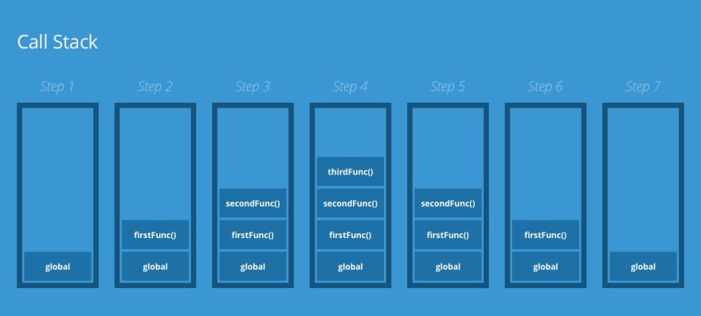
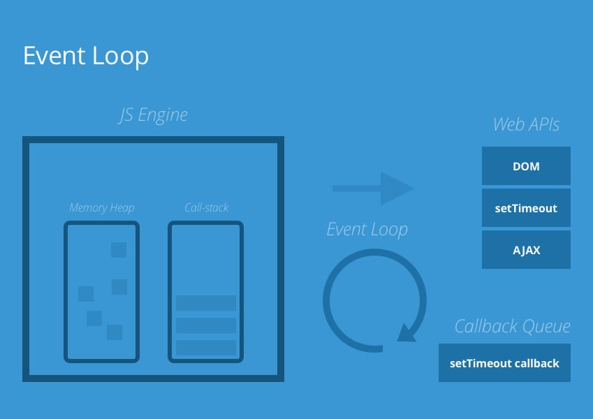

# [鐵人賽 2022-擊敗前端面試大作戰] The Execution Context, Call-stack and Event Loop

今天是鐵人賽正文的第五天了，大家都還好嗎？今天呢要來講一個我覺得很有趣的題目---Event loop，這題在面試中被問到的機會非常的高，我自己就有在面試中被問到超過兩次！所以如果在面試中可以把這些細節都講出來，我覺得是會讓面試官眼睛一亮的！那我們就進入主題吧～

## 什麼是 Event Loop 事件循環

簡單回答：Event Loop 是一個 JS 得機制，讓我們可以處理非同步的動作。

## Event Loop 解決了什麼問題？

JS 本身是 單線程序（single-threaded），代表一次只能有一件事能被執行，所以當出現一個很大的計算的時候，就會導致後面的計算沒辦法被執行。而透過 Event Loop 我們可以解決這個問題。

面試回答思路：回答 event loop 的定義，然後帶到 The Execution Context 跟 Call-stack

要理解到 event loop 我們必須先知道`The Execution Context`跟`The Call-stack`是
什麼，下面我們先來看`The Execution Context`:

## The Execution Context

```js
const a = 10;

function text() {
  return "text";
}
```

你有沒有想過一個問題，當你在瀏覽器上面跑 Js 得時候，背地裡發生了什麼事情？瀏覽器是怎麼執行我們傳送給他的 Js 程式碼的？或是像上面這段程式碼在執行時，到底瀏覽器是怎麼去跑他的？要回答這些問題，我們必須先講到`The Execution Context`。

當一段程式碼被執行時，會先產生 全局的 `Execution Context`。然後 瀏覽器引擎 進入 `creation phase` ，四件事情會發生：

1. 建立 全局 物件，它在 瀏覽器 中被稱作`window`，在 Node 中被稱作`global`
2. 建立 `this` 並且指向 全局 物件
3. 建立一個 memory heap 來儲存 變數 和 函式的 references
4. 把 函式宣告式 (ex, function s()...)儲存在 memory heap 中， 然後把 memory heap 裡面的 變數 賦予`undefined`

所以以上面的程式碼為例，這時候我們的 全局的 `Execution Context` 會有以下幾個東西，

1. 全局 物件，裡面的值是 window
2. this，也指向 window
3. a，值是 undefined
4. function text

大家還記得 let, const 和 var 那篇文章嗎？裡面有個例子長這樣，

```js
printName(); //John

function printName() {
  console.log("John");
}
```

然後當時我說`function 會被 hoisted，但是可以被使用。`，現在了解`Execution Context`的機制後，我們終於知道為什麼 function 可以被提前使用了！

回到原本的情況，`creation phase`完成後，瀏覽器 會進入下一個階段`execution phase`。

在這個階段，程式碼會被一條條的執行，

1. 變數 會被賦予值，
2. function 則會被執行，並且在每個 function 被執行時，瀏覽器引琴 都會 建立 一個 `Function Execution Context` （類似上面的 全局` Execution Context`），但是 全局 物件會被指到 `arguments`物件，裡面會儲存所有傳進 function 的值。

這個階段後， 全局的 `Execution Context`會長這樣：

1. 全局 物件，裡面是 window
2. this，也指向 window
3. a，值為 10
4. function text

keyword: `Global Execution Context`, `creation phase`, `execution phase`

&nbsp;

這時候有個問題來了，當我們出現多個嵌套的（nested)函式時，我們知道會觸發多個`Function Execution Context`，那瀏覽器引擎又要怎麼去執行這些函式呢？這就要談到`The Event Loop`和 `callback queue`了！但在那之前，我們還先需要知道兩個東西`The Call-stack`和`The callback queue`。

&nbsp;

## The Call-stack

: `The call-stack` 是一種資料結構（stack）用來追蹤和管理`function execution`。

實際情況：`The call-stack` 依照 Last In First Out 的規矩，當 瀏覽器引擎 執行 到 函式 時，會把該 函式 push 到 `call-stack` 裡，並且在執行該 函式 時，會把該 函式 從`call-stack` 中 pop 掉，



&nbsp;

## The callback queue

: `The callback queue`是一種資料結構 queue 用來追蹤跟管理需要被晚點執行的事件，包含 setTimeout, setInterval 等等。First-in, First-out

**這裡只有簡略講解 stack 和 queue，實際的實踐方式有興趣的讀者可以上網自行研究摟**

## The Event Loop and The callback queue

解決的問題：讓 JS 可以執行非同步的動作（ex, network request）

&nbsp;



講了這麼多，現在終於講到 event loop 的精彩階段了！`The event loop`會去追蹤 `call-stack`中需要執行 非同步 的 函式,當執行到該 函式 時把他丟入`callback queue`中,

1. 當 `call-stack`其他 function 都執行完，變回空的時候。
2. 處理 `callback queue`中的 function 丟回到`call-stack`上來執行。

`callback queue`的執行順序為： Microtask > Macrotask

常見的 microTask: Promise  
常見的 macroTask: setTimeout, setInterval... (與瀏覽器或電腦底層的運作較有關係)

```js
setTimeout(() => alert("timeout"));

Promise.resolve().then(() => alert("promise"));

alert("global ex. context");

// global ex. context
// promise
// timeout
```

&nbsp;

# Resources

https://dev.to/thebabscraig/the-javascript-execution-context-call-stack-event-loop-1if1
https://pjchender.dev/javascript/note-event-loop-microtask/

https://www.educative.io/answers/what-is-an-event-loop-in-javascript

Example,

```js
function thirdFunc() {
  console.log("Greetings from thirdFunc()");
}

function secondFunc() {
  thirdFunc();
  console.log("Greetings from secondFunc()");
}

function firstFunc() {
  secondFunc();
  console.log("Greetings from firstFunc()");
}

firstFunc();

// Greetings from thirdFunc()
// Greetings from secondFunc()
// Greetings from firstFunc()
```
