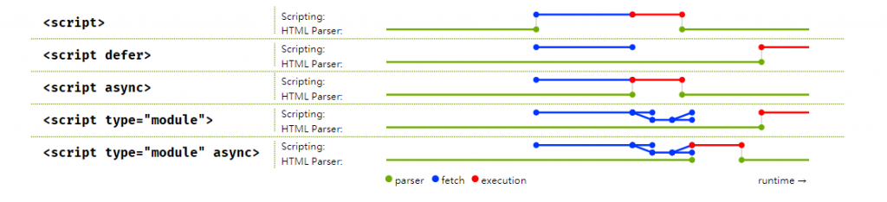
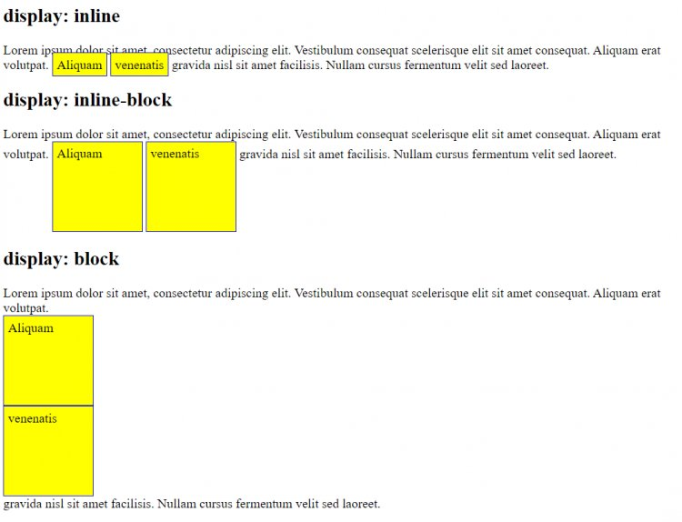

# [鐵人賽 2022-擊敗前端面試大作戰] HTML/CSS

今天是擊敗前端面試大作戰正文的第一篇！我們就先來點輕鬆的吧，今天會討論文章的寫作方式會是以面試問答為主，歡迎讀者先把回答遮住試著達看看，再看回答!。

## 這一篇文章適合誰看

**適合閱讀者**

1. 對 HTML/CSS 已經有一定的瞭解。
2. 或是最少已經有看過 w3school 對 [html](https://www.w3schools.com/html/)和 [css](https://www.w3schools.com/css/)的文章。

## 開頭

HTML/CSS 在面試題中算是比較少考的部分，以我自己的經驗為例，大部分的公司在面試前端工程師這個職位的時候有大概 90 趴的比重會是在考 JS/框架/瀏覽器/演算法，只有大概 10 趴會問到 HTML/CSS。而剩下的少部分公司會考大量的 HTML/CSS，這時候就要注意一下該公司是不是在徵工作內容注重在切版的工程師(我個人是對寫 JS 邏輯、優化比較有興趣～)。

所以在 HTML/CSS 準備的部分，會根據你想做的工作內容而有不同得準備方向。
以 JS 邏輯為主要工作內容的職缺，我覺得了解基本的 HTML5、跟常用的 CSS flexBox/grid、選擇符、position、display 跟 CSS 有的問題和如何解決（ex, 用 css modules 來解決命名衝突）等等就非常足夠了！

那如果你對上面我列出來了的 HTML/CSS 都蠻熟悉的話，下面有些考題可以試試看你對 HTML/CSS 的熟悉度！

&nbsp;

## 面試題牛刀小試

### 1. src vs href 的差別?

回答：  
src 用於替代元素，而 href 用於建立這個標籤與外部資源之間的關係。舉例，

`<link href="style.css" rel="stylesheet" />`  
當使用 href 的時候，瀏覽器載入到 link 的時候，**html 的渲染和解析不會暫停，而 css 檔案的載入是同時進行的**。

`<script src="script.js"></script>`

當使用 src 時，瀏覽器解析到 script 時，**頁面的載入和解析都會暫停直到瀏覽器拿到並執行完這個 js 檔案，因此會建議把`script`放到`<body>`的最下面**。

follow up 問題: `defer`和`script`的差別？

回答:  
HTML5 中新增了`defer`和`async`在`script`中，當使用 `defer` 時，**執行到該 `script` 時會繼續建立 DOM,並且非同步的去跑該 `script`,但是會等到 DOM 建立完成後才會去執行該 `script`**。  
而當使用 `async` 時，**執行到該 `script`,就會非同步的去跑該 `script`,跑完後直接執行**，因此 `async` 適合用在 GA,或是其他不會影響使用者體驗的地方。

說這麼多我們來看圖比較好理解！



**注意：defer 和 async 屬性都是非同步下載外部的 JS 腳本文件，它們都不會阻塞頁面的解析**

&nbsp;

### 2. HTML 語義化優點?

回答：

- 增加程式碼可讀性，可以馬上知道程式的結構。
- 有利於 SEO，有助於爬蟲到到更多訊息。

&nbsp;

### 3. display:inline-block, block, inline 的區別及差別

回答：

inline-block，會以 block 的方式呈現，但可以在同一列 inline 水平並列，它可以設定元素的寬高/margin/padding。

inline，為行內元素，元素的寬高/margin/padding 接不可以改變，多個相鄰的行內元素排在同一行裡，如果頁面一行排列不下，才會換新的一行。

block，可以設定元素的寬高/margin/padding，並且每個 block 都是新的一行。



&nbsp;

### 4. CSS Modules VS. styled-components？

回答思路：  
可以先從單純 css 所遇到的問題開始講起，然後提到這兩個的不同。

回答：
原生 CSS 因為缺乏變量、函數這等方法，導致程式碼的維護性不高而且無法復用。除此之外，原生 CSS 還會造成**全局汙染**的問題，同樣名稱的選擇器會造成樣式覆蓋等等問題。因此出現 CSS Module 和 CSS-in-JS 的解決方法，兩者的特點如下：

CSS Module

- 利用文件名來產生 hash className 來解決命名衝突的問題
- 然後搭配 Sass 或是 Less 來增加變量、函數等特性來增加維護性

styled-components 則是 CSS-in-JS 其中一種

Pros:

- 可讀性佳，好維護因為相關的 css 會在同一個區塊
- 解决了 class name 冲突
- 简单的动态样式: 可以在 style 中加入 props
- 自动提供前缀(如同 postCSS，來解決跨瀏覽器問題)

cons:

- 樣式是和 JS 文件打包在一起，所以會拖慢 JS 文件加載時間
- 沒有單獨 CSS 文件所以無法緩存

&nbsp;

### 5. 什麼是 postCSS?

回答：  
PostCSS 是一個 plugins 用來轉換 CSS，可以把它想成 CSS 的 babel，透過 postCSS，我們可以做到以下幾件事：

- Autoprefixer
  :用來處理跨瀏覽器的支援度。

```css
//原先的CSS
:fullscreen {
}

//編譯過後的CSS
:-webkit-full-screen {
}
:-ms-fullscreen {
}
:fullscreen {
}
```

- cssnext
  : 透過 polyfills，讓我們可以使用新的語法。

```css
//原先的CSS，瀏覽器尚未支援
body {
  color: oklch(61% 0.2 29);
}

//編譯過後的CSS
body {
  color: rgb(225, 65, 52);
}
```

- stylelint
  : css 的 lint

```css

//輸入錯誤的CSS顏色
a {
  color: #d3;
}

//報錯
app.css
2:10 Invalid hex color


```

[postCSS 網站](https://postcss.org/)

&nbsp;

### 6. 垂直置中？

回答：  
[我的範例](https://codesandbox.io/s/intelligent-lamarr-xrbi95?file=/src/App.js)

關於垂直置中，我推薦兩個不錯的學習資源～  
[學習資源 1](https://www.w3schools.com/css/css_align.asp）  
[學習資源 2]https://css-tricks.com/centering-css-complete-guide/

&nbsp;

### 7. DOCTYPE?

回答：doctype 用來宣告文件 render 的方式，如果沒有在文件中加上 doctype 的話，瀏覽器就會用向下兼容的模式來執行該文件。

推薦閱讀文章: https://ithelp.ithome.com.tw/articles/10236447

這一篇的 HTML 和 CSS 就討論到這裡~~今天這篇只是小試牛刀，下一篇開始就會上主菜，開始討論 JS 摟，那我們就明天見吧！

&nbsp;

推薦的面試題資源：

HTML:  
https://juejin.cn/post/6905294475539513352

CSS:  
https://hackmd.io/@mingjunlu/front-end-interview-questions

Resources:

https://onurkul.com.tr/css-satir-ici-blok-inline-block
https://hackmd.io/@mingjunlu/front-end-interview-questions
