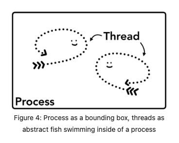
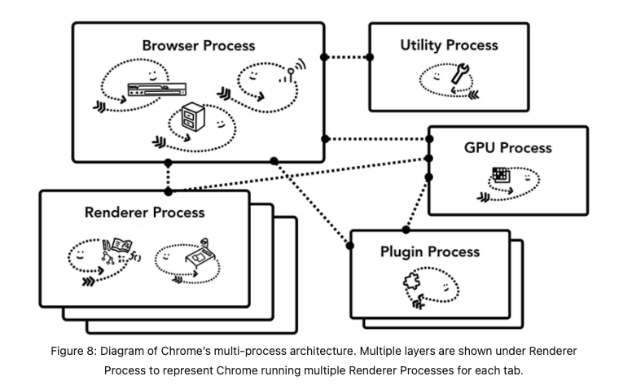

# [others] Computer science basics

## General knowledge

### 單位

```js
1b (bit 位，比特位，计算机表示数据最小的单位, 二进制的范畴，存放一位二进制数，即0或1)
1B (Byte 字节)
1KB (Kilobyte 千字节)
1MB (Megabyte 兆字节 简称“兆”)
1GB (Gigabyte 吉字节 又称“千兆”)
1TB（Tera Byte 1000吉(千兆)字节(GB)、兆兆位(量度信息单位）
```

```js
1 b 即 1 bit
1 Byte = 8 Bits（即 1B=8 bit）
1 KB = 1024 Bytes
1 MB = 1024 KB
1 GB = 1024 MB
1 TB = 1024 GB
```

### 32bit vs 64 bit

When it comes to computers, the difference between 32-bit and a 64-bit is all about processing power. Computers with 32-bit processors are older, slower, and less secure, while a 64-bit processor is newer, faster, and more secure.  
Your computer’s central processing unit (CPU) functions like the brain of your computer. It controls all the communication and the flow of data to and from the other parts of your computer. Some computers use two or more processors. However, there are only two main categories of processors now: 32-bit processors and 64-bit processors. The type of processor that your computer uses affects its overall performance and what kind of software it can utilize.

Most computers made in the 1990s to early 2000s have a 32-bit system that can access 2^32 (or 4,294,967,296) bytes (units of digital information) of RAM (random access memory). Meanwhile, a 64-bit processor can handle 2^64 (or 18,446,744,073,709,551,616) bytes of RAM. In other words, a 64-bit processor can process more data than 4 billion 32-bit processors combined.

64 位元計算主要有兩大優點：可以進行更大範圍的整數運算；可以支援更多的記憶體空間。

https://www.hellotech.com/blog/whats-the-difference-between-32-bit-and-64-bit

### Unicode & ASCII

推薦閱讀文章：https://pjchender.dev/webdev/guide-unicode/#%E5%8F%AA%E4%BD%BF%E7%94%A8%E5%88%B0-unicode-%E5%9F%BA%E6%9C%AC%E5%B9%B3%E9%9D%A2%E6%99%82u%E7%A2%BC%E9%BB%9E

解決問題：Unicode 跟 ASCII 的出現是為了解決電腦看不懂人類文字的問題。

The American Standard Code for Information Interchange (ASCII) was an early standardized encoding system for text. Encoding is the process of converting characters in human languages into binary sequences that computers can process.

cons: it only includes English and some common symbols(like /, !, and ?).

#### UTF-8 vs UTF-16

解決問題：ASCII 是以英文字母來建造，無法使用亞洲文字(中文/日文等等)，所以出現了 Unicode 來讓全世界的語言都能夠轉換成電腦讀得懂的語言。

UTF-8 encoding is preferable to UTF-16 on the majority of websites, because it uses less memory. Recall that UTF-8 encodes each ASCII character in just one byte. UTF-16 must encode these same characters in either two or four bytes. This means that an English text file encoded with UTF-16 would be at least double the size of the same file encoded with UTF-8.

UTF-16 is only more efficient than UTF-8 on some non-English websites. If a website uses a language with characters farther back in the Unicode library, UTF-8 will encode all characters as four bytes, whereas UTF-16 might encode many of the same characters as only two bytes. Still, if your pages are filled with ABCs and 123s, stick with UTF-8.

https://blog.hubspot.com/website/what-is-utf-8

## Wed-related knowledge

### TCP (Transmission Control Protocol) 傳輸控制協定

https://www.fortinet.com/resources/cyberglossary/tcp-ip

TCP/IP 跟 OSI model 圖示：  
https://fiberbit.com.tw/tcpip-model-vs-osi-model/

TCP:
Transmission Control Protocol (TCP) is a communications standard that enables application programs and computing devices to exchange messages over a network. It is designed to send packets across the internet and ensure the successful delivery of data and messages over networks.

IP:
The Internet Protocol (IP) is the method for sending data from one device to another across the internet.

TCP and IP are separate protocols that work together to ensure data is delivered to its intended destination within a network. IP obtains and defines the address—the IP address—of the application or device the data must be sent to. TCP is then responsible for transporting and routing data through the network architecture and ensuring it gets delivered to the destination application or device that IP has defined

### HTTP vs HTTPS

HTTP（超文本傳輸協定）是一種協定，用於在 Web 瀏覽器和 Web 服務器之間傳輸資料。它是一種明文協定，這意味著通過 HTTP 傳輸的數據未經加密，可以被任何具有網路流量訪問權限的人截取和閱讀。

HTTPS（超文本傳輸安全協定）是 HTTP 的一個更安全的版本，使用加密技術保護 Web 瀏覽器和 Web 服務器之間傳輸的資料。HTTPS 使用傳輸層安全性（TLS）和安全套接字層（SSL）協定的組合對數據進行加密，這使得攻擊者更難截取和閱讀傳輸的資料。

### HTTP1 vs HTTP2

https://cheapsslsecurity.com/p/http2-vs-http1/

HTTP2 閱讀文章:
https://hieven.medium.com/http-2-%E5%BE%9E%E9%9B%B6%E5%88%B0%E4%B8%80-be221087cd35

HTTP/1.1 的主要問題之一是它只允許在單個連接(TCP connection)上同時發送一個請求。這意味著如果一個網站有許多需要加載的資源，例如圖片、腳本和樣式表，瀏覽器必須打開多個連接到服務器，這會導致頁面加載時間變慢。

HTTP/2 被引入來解決 HTTP/1.1 的這些限制。它提供了幾個性能上的改進，包括：

- 多路複用：HTTP/2 允許在單個連接上發送和接收多個請求，消除了加載網頁所需的多個連接的需求，從而加快了頁面加載速度。

- 服務器推送：HTTP/2 允許服務器在不等待請求的情況下向客戶端推送資源，提高網站性能，減少延遲。

- 二進制協議：HTTP/2 使用二進制協議而不是基於文本的協議，減少需要傳輸的數據量，提高性能。

- 頭部壓縮：HTTP/2 壓縮頭部數據，減少需要傳輸的數據量，提高性能。

### Web socket

https://www.readfog.com/a/1649297763805007872

### REST 架構

Representational State Transfer，簡稱 REST，它是一種網路架構風格，近幾年來 REST 的概念已經被實作在大型網路系統中，而在 Web Service 中使用 REST 概念被實作出來的 API 就簡稱為 RESTful API 。

一個 REST request 是由以下幾個東西所組成：

- `endpoint`
- `HTTP method`
- `Header`
- `Body`

#### 常見的`HTTP method`

`POST 新增新資料 (create)`

`PUT 更改資料 (update)`

`PATCH 指更改小筆資料(ex, 一個欄位)`

`PATCH`

`DELETE`

When working with data, a RESTful API uses HTTP methods to perform CRUD (Create, Read, Update and Delete) operations.

#### HTTP status code

`2xx success`

`3xx redirection`

`4xx client error`

`5xx server error`

### http-proxy

Frontend proxy can be called reverse proxy. It’s a type of proxy server that can retrieve data from one or many servers to client app. Those resources are returned to client side in original from the server.

Example usages of reverse proxy are:

- bypass CORS errors （CORS Proxy allows us to bypass CORS errors using a proxy server that acts as a bridge between the client and the server. ）
- it can distribute load from incoming requests to many servers.
- it can add basic HTTP authentication access to a web server
- it can optimize content by compressing it and speed up a load time
- it can cache some static content to reduce time of load

vite config 也有提供 http-proxy 選項  
https://vitejs.dev/config/server-options.html#server-proxy

github:

https://github.com/http-party/node-http-proxy#options

build your own proxy server:

https://jakemccambley.medium.com/fixing-cors-errors-when-working-with-3rd-party-apis-a69dc5474804

### Inside look at modern web browser

Resources:  
https://developer.chrome.com/blog/inside-browser-part1/

#### GPU and CPU

CPU(Central Processing Unit): A CPU core can be considered your computer’s brain, it handles many different tasks one by one as they come in.

GPU(Graphics Processing Unit): it handles graphic.

#### Process and thread



Program: Program 指的是 IDE、editor 等所寫的程式碼(code)，也就是說還尚未 load 入記憶體的 code。

Process:Process 意旨已經執行並且 load 到記憶體中的 Program ，程序中的每一行程式碼隨時都有可能被 CPU 執行，在實際生活中，點開應用程式就是將 Program 活化成 Process，Process 就是實體的工廠，照著 Program 這張設計藍圖所完成的工廠。

Thread: Process 中的工人，負責執行 process 中的程序。

資料來源: https://totoroliu.medium.com/program-process-thread-%E5%B7%AE%E7%95%B0-4a360c7345e5

#### shell vs zsh vs cmd

Shell, cmd, and zsh are all command-line interfaces (CLIs) used for interacting with an operating system.

Shell: The term "shell" generally refers to a program that provides a command-line interface for interacting with an operating system. Some of the most popular shells are Bash, zsh, sh, and csh. Shells provide features such as command-line completion, command history, and shell scripting. Bash is the default shell on most Linux distributions and macOS.

cmd: cmd is the command-line interpreter for the Windows operating system. It provides a command prompt where users can enter commands to perform various tasks such as managing files, running programs, and configuring system settings.

zsh: zsh is an advanced shell designed for interactive use. It provides many features not found in other shells, such as advanced command-line completion, spelling correction, and globbing. zsh is also highly customizable and supports plugins and themes.

#### Browser Architecture

**每個 browser 中的 Architecture 都不一樣**


#### SDK and API

https://hackmd.io/@metal35x/SJpPMBGSI

閱讀文章:

1. https://blog.techbridge.cc/2017/06/17/cache-introduction/
2. https://ithelp.ithome.com.tw/m/articles/10219276

#### VPN

https://nordvpn.com/zh-tw/what-is-a-vpn/

#### 內網 vs 外網

https://stevessmarthomeguide.com/internal-external-ip-addresses/

#### 加密

##### 編碼（Encoding）

:換個方式表達，所以只要知道轉換工式，就可以還原回來

```js
// 1
encodeURL();
decodeURL();

// 2
Base64;
```

##### 加密（Encrypt）

##### 對稱加密

:用同一個 key 加密跟解密

缺點：

1. key 要傳送給對方
2. key 遺失或是被竊取，就會造成資料外洩

AES (Advanced Encryption Standard)
ex, OpenSSL

##### 非對稱加密

:產生公鑰跟私鑰，公鑰用來加密，私鑰用來解密，公鑰可以公開，私鑰要保密

ex, RSA

##### Hash 雜湊

：透過一系列的運算得到值，這是一個單向運算，無法透過雜湊值反推出原本的值。

https://medium.com/starbugs/what-are-encoding-encrypt-and-hashing-4b03d40e7b0c
