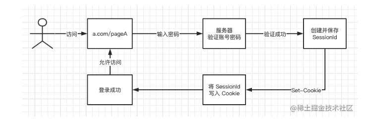
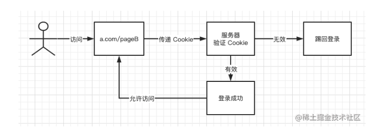
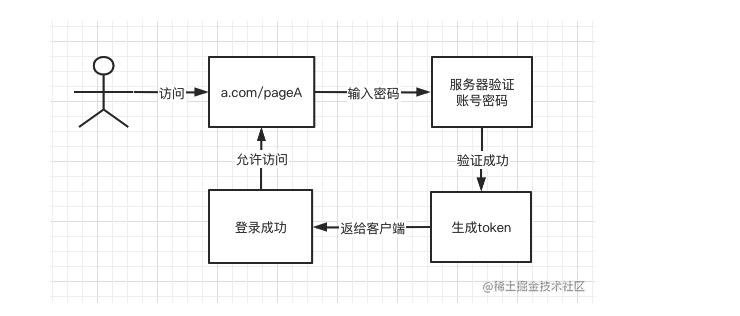
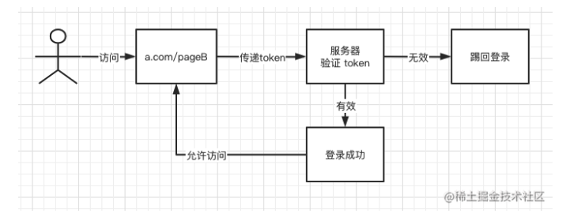

# [others] 前端登入

四種前端登入的方法：

1. Cookie + Session 登錄
2. Token 登錄 (ex, JWT)
3. SSO 單點登錄
4. OAuth 第三方登錄

## Cookie + Session 登錄

首次登入時的狀態：  

- 登入成功後，後端會產生一組 sessionId 儲存在後端並且同時把該 id 和 expire date 寫入在 cookie 中，然後回傳給前端，來做下次登入時的驗證。

express 中常用的 session 生成套件。  
https://www.npmjs.com/package/express-session

或是也可以用 uuid, date 來實作一個 session method。

再次登入狀態：  

- 在進到頁面時，如果沒有帶 cookie 或是 cookie 中的 session 已經無效，就把使用者導覽回登入頁面。

### Cookie + session 的問題

1. session 需要儲放在後端，在大量使用者的情況下，會造成需要儲存很多使用者 session 資料的問題。

## token 登入

token 登入跟 session/cookie 登入最大的不同，是他解決了要在後端儲存多餘資料的問題。token 會在 server 中生成但是並不會儲存在 server，而是直接儲存在前端。

首次登入時的狀態：  

再次登入狀態：  

JWT 算法主要分為 3 個部分：header（頭信息），payload（消息體），signature（簽名）。header 部分指定了該 JWT 使用的簽名算法，payload 部分表明了 JWT 的意圖，signature 部分為 JWT 的簽名，目的是為了讓 JWT 不能被隨意篡改

---

文章/圖片出處：

https://juejin.cn/post/6845166891393089544
