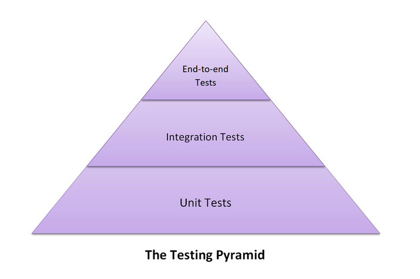

# [others] Testing



## 前端測試種類

### Unit Test(单元测试)

unit 是程式碼中最小的一個功能的單位，其可以是一個 function,class 等等。做 unit test 來確保最小單位的程式碼是正常的，並且在 refactoring 時，也可以透過 unit test 來確保 refactor 過後的程式碼結果是一樣的。

```js
function sum(a, b) {
  return a + b;
}

test("1 + 2 equals 3", () => {
  expect(sum(1, 2)).toBe(3);
});
```

#### Component Tests

用來測試 component 是否顯示成想要顯示的樣子。

#### Snapshot Tests

透過用目前的 UI snapshot 跟更動之後的 UI snapshot 來確保 UI 沒有在意料之外中做變動，

### Integration Test(整合測試)

### End-to-End Tests （e2e 測試）

測試功能的流程來確保功能流程是正常的。

```js
describe("My First Test", () => {
  it("Gets, types and asserts", () => {
    cy.visit("https://example.cypress.io");

    cy.contains("type").click();

    // Should be on a new URL which includes '/commands/actions'
    cy.url().should("include", "/commands/actions");

    // Get an input, type into it and verify that the value has been updated
    cy.get(".action-email")
      .type("fake@email.com")
      .should("have.value", "fake@email.com");
  });
});
```

---

Resources: https://meticulous.ai/blog/testing-pyramid-for-frontend/

## 測試術語

### 黑箱測試、白箱測試

白箱測試：測試正常的使用流程
黑箱測試：用非正常的使用方式來測試 ex, 測試大流量時網頁是否會 crashed
